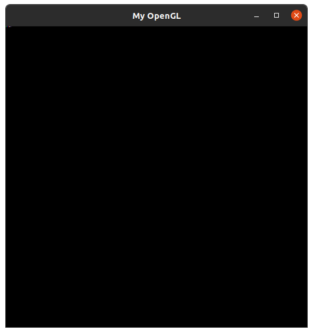
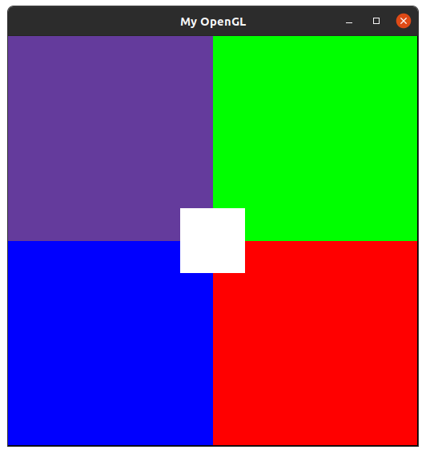

# Computação Gráfica

Aqui são apresentados os resultados das atividades práticas da disciplina de <b>Introdução à Computação Gráfica</b>, ministrada no <i>Período Suplementar</i> na UFPB.

# Sumário
1. [Rasterização](#atividade1)
    
    - [Link para pasta do código]("1_rasterizacao") 


# Atividade 1 - Rasterização <a id="atividade1"></a>

Simulando o acesso a memória de vídeo do computador, através de um <a href="https://github.com/capagot/icg/tree/master/mygl_framework">framework</a> fornecido pelo professor,  foi feita a rasterização de pontos e linhas. A partir delas, também foi feita a rasterização de triângulos, com as arestas baseadas na rasterização das linhas feitas anteriormente. E com a criação de retas, também foi feita a interpolação linear das cores das duas pontas, para que haja uma transição entre as duas cores em sua extensão

> Tamanho da tela definida pelo framework é de 512x512 pixels

> Struct foi utilizado para a definição das cores

> Todas as cores utilizadas no trabalho foram Branco, Vermelho, Verde, Azul e uma cor randômica (próximo do Lilás) respectivamente, definidas por:
>```C
> Color ColorWhite = {.red = 255, .green = 255, .blue = 255, .alpha = 255};
> Color ColorRed = {.red = 255, .green = 0, .blue = 0, .alpha = 255};
> Color ColorGreen = {.red = 0, .green = 255, .blue = 0, .alpha = 255};
> Color ColorBlue = {.red = 0, .green = 0, .blue = 255, .alpha = 255};
> Color ColorRandom = {.red = 100, .green = 59, .blue = 156, .alpha = 255};
> ```

## Rasterização do ponto

A implementação da rasterização do ponto foi feita com a função `PutPixel(int x, int y, cor RGBA)`, onde:

- X contém a informação da coordenada <i>x</i> na tela
- Y contém a informação da coordenada <i>y</i> na tela
- RGBA contém as informações referentes a cor do pixel desenhado, <i>red</i> (vermelho), <i>green</i> (verde), <i>blue</i> (azul) e <i>alpha</i> (transparência)

### Resultados

Neste exemplo podemos ver a ação da função `PutPixel(x, y, RGBA)` com a impressão de um pixel de cada cor na primeira linha da janela.



Na imagem a seguir, a fim de mostrar de uma forma mais clara a ação do `PutPixel(x, y, RGBA)` na tela, através de uma estrutura de repetição, foram desenhados blocos de cores em toda a tela.



Com isso foi possível mostrar que para cada espaço na tela disponível, foi possível acessar um endereço de memória e colocar as informações de cores desejadas para a criação de imagens.
