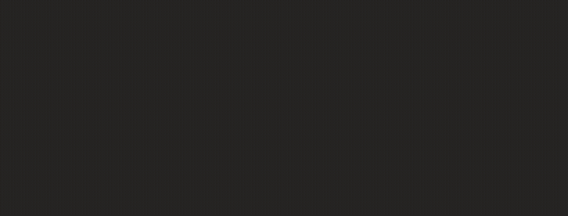
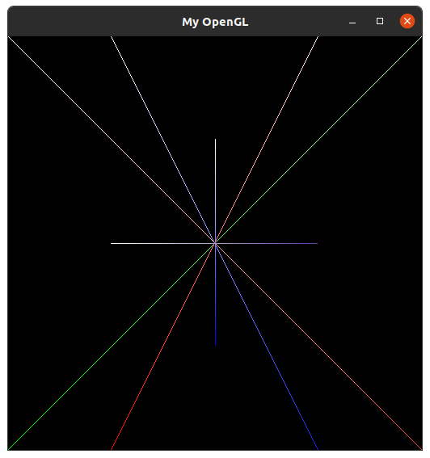
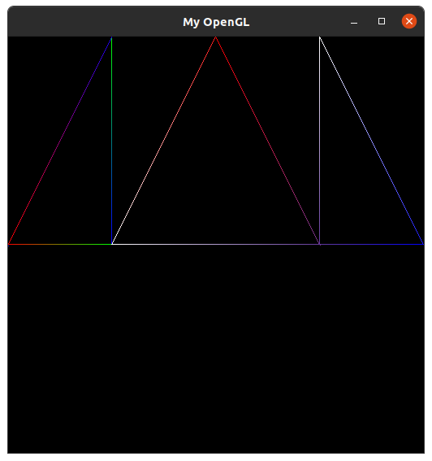
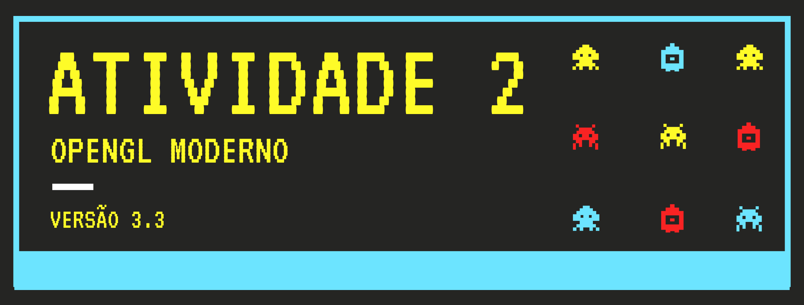

Aqui são apresentados os resultados das atividades práticas da disciplina de <b>Introdução à Computação Gráfica</b>, ministrada no <i>Período Suplementar</i> na UFPB.

# Sumário
1. [Configuração do Ambiente](#config)
2. [Atividade 1 - Rasterização](#atividade1)
    - [Rasterização do Ponto](#rasteriza-ponto)
        - [Resultados](#resultados-ponto)
    - [Rasterização da Linha](#rasteriza-linha)
        - [Resultados](#resultados-linha)
        - [Problemas e Soluções](#prob-linha)
    - [Rasterização do Triângulo](#rasteriza-triangulo)
        - [Resultados](#resultados-triangulo)
    - [Referências](#referencias1)
3. [Atividade 2 - OpenGL Moderno](#atividade2)
    - [Resultados](#resultado-atv2)
    - [Referências](#referencias2)

# Configuração do Ambiente <a id="config"></a>

Para a realização das atividades a seguir, foi seguido um guia de instalação dos pacotes básicos que pode ser encontrado <a href="https://pt.wikibooks.org/wiki/Programa%C3%A7%C3%A3o_com_OpenGL/Instala%C3%A7%C3%A3o/Linux">neste link</a>. Os comandos básicos para realizar a instalação foram:

```
sudo apt-get update
sudo apt-get install libgl1-mesa-dev
sudo apt-get install build-essential
sudo apt-get install libglew1.5-dev freeglut3-dev libglm-dev
```

Caso ocorra algum problema com os drivers ou versão, o link citado anteriormente fala sobre possíveis soluções. Para a execução dos códigos basta acessá-los nas pastas do repositório e executar:

```
make
./nome-do-executável
```

---
---


<!---
# Atividade 1 - Rasterização <a id="atividade1"></a>
-->

Simulando o acesso a memória de vídeo do computador, através de um <a href="https://github.com/capagot/icg/tree/master/mygl_framework">framework</a> fornecido pelo professor,  foi feita a rasterização de pontos e linhas. A partir delas, também foi feita a rasterização de triângulos, com as arestas baseadas na rasterização das linhas feitas anteriormente. E com a criação de retas, também foi feita a interpolação linear das cores das duas pontas, para que haja uma transição entre as duas cores em sua extensão

> Tamanho da tela definida pelo framework é de 512x512 pixels

> Struct foi utilizado para a definição das cores

> Todas as cores utilizadas no trabalho foram Branco, Vermelho, Verde, Azul e uma cor randômica (próximo do Lilás) respectivamente, definidas por:
>```C
> Color ColorWhite = {.red = 255, .green = 255, .blue = 255, .alpha = 255};
> Color ColorRed = {.red = 255, .green = 0, .blue = 0, .alpha = 255};
> Color ColorGreen = {.red = 0, .green = 255, .blue = 0, .alpha = 255};
> Color ColorBlue = {.red = 0, .green = 0, .blue = 255, .alpha = 255};
> Color ColorRandom = {.red = 100,.green = 59, .blue = 156, .alpha = 255};
> ```
 
## Rasterização do ponto <a id="rasteriza-ponto"></a>

A implementação da rasterização do ponto foi feita com a função `PutPixel(int x, int y, cor RGBA)`, onde:

- X contém a informação da coordenada <i>x</i> na tela
- Y contém a informação da coordenada <i>y</i> na tela
- RGBA contém as informações referentes a cor do pixel desenhado, <i>red</i> (vermelho), <i>green</i> (verde), <i>blue</i> (azul) e <i>alpha</i> (transparência)

### Resultados <a id="resultados-ponto"></a>

Neste exemplo podemos ver a ação da função `PutPixel(x, y, RGBA)` com a impressão de um pixel de cada cor na primeira linha da janela.


Na imagem a seguir, a fim de mostrar de uma forma mais clara a ação do `PutPixel(x, y, RGBA)` na tela, através de uma estrutura de repetição, foram desenhados blocos de cores em toda a tela.


Com isso foi possível mostrar que para cada espaço na tela disponível, foi possível acessar um endereço de memória e colocar as informações de cores desejadas para a criação de imagens.

## Rasterização da linha <a id="rasteriza-linha"></a>

A implementação da rasterização da linha foi feita com a função `DrawLine(int x1, int y1, cor RGBA1, int x2, int y2, cor RGBA2)`, onde:

- X1 e Y1 contém a informação da coordenada <i>(x1, y1)</i> do primeiro ponto na tela, junto com <i>RGBA1</i> contendo as informações da sua cor
- X2 e Y2 contém a informação da coordenada <i>(x2, y2)</i> do segundo ponto na tela, junto com <i>RGBA2</i> contendo as informações da sua cor

Uma reta é criada entre os dois pontos dados, utilizando uma variação do  <b>algoritmo de Bresenham</b>, conhecida como <i>Mid Point Line</i>. Além disso, como foi mencionado anteriormente, também foi feita uma <i>interpolação linear</i> das cores entre os dois pontos.

### <b>Resultados</b> <a id="resultados-linha"></a>

Na figura a seguir é possível visualizar algumas retas criadas para testar o desenho das linhas em todos os octantes do plano.



### <b>Problemas e Soluções</b> <a id="prob-linha"></a>

A parte mais dificultosa para a rasterização das linhas foram as condições que precisam ser levadas em consideração para que as linhas pudessem ser desenhadas em todos os octantes possíveis do plano. Depois de analisar o problema e definir as restrições a serem seguidas, o seguinte algoritmo foi seguido:

> - Restrição 1
>   - Problema: Verifica se ΔX é negativo. Se for, é porque a linha está crescendo para o lado negativo de X.
>   - Solução: Troca o ponto inicial pelo ponto final, assim em vez da reta ser desenhada para a direção negativa do X, agora será desenhada para o lado positivo.
>
> - Restrição 2
>   - Problema: Verifica se ΔY é negativo. Se for, é porque a linha está crescendo para o lado negativo de Y.
>   - Solução: Multiplica ΔY por -1. Assim a referência para os pontos <i>Leste</i> e <i>Nordeste</i> ficam corretas. Depois disso, como o ponto Y inicial é maior que o ponto Y final, para o desenho ser feito corretamente, ele deve ser decrementado em vez de incrementado.
>
> - Restrição 3
>   - Problema: Verifica se ΔY é maior que ΔX. Se for, é porque a reta cresce mais para o lado de Y do que em X.
>   - Solução: Tudo que era em relação a X, agora passará a funcionar em relação a Y. Portanto, todos os ΔY e ΔX devem ser trocados no cálculo de d inicia, incremento em Leste e incremento em Nordeste. Quando o leste é escolhido, também mudará para crescer em Y, não X. Além disso, a reta que era desenhada enquanto `x1 <= x2`, agora passa a ser desenhada enquanto `y1 <= y2`. 
>
> - Restrição 4
>   - Problema: Verifica se ΔY é maior que ΔX e também se ΔY é negativo. Se corresponder a essas duas condições, é porque a reta cresce mais para o lado de Y negativamente em relação a X.
>   - Solução: A solução é semelhante a anterior, porém seguirá a mesma lógica da restrição 2. Agora crescerá em relação a Y e deverá ser decrementada, pois o ponto final de Y é menor que o inicial. Além disso, a condição `y1 <= y2` não será mais válida, pois o ponto inicial naturalmente é maior que o final. Então o desenho será realizado enquanto a condição `y1 > y2` acontecer.

## Rasterização do Triângulo <a id="rasteriza-triangulo"></a>

A implementação da rasterização da linha foi feita com a função `DrawLine(int x1, int y1, cor RGBA1, int x2, int y2, cor RGBA2, int x3, int y3, cor RGBA3)`, onde:

- X1 e Y1 contém a informação do vértice <i>(x1, y1)</i> do triangulo, junto com <i>RGBA1</i> contendo as informações da sua cor
- X2 e Y2 contém a informação do vértice <i>(x2, y2)</i> do triangulo, junto com <i>RGBA2</i> contendo as informações da sua cor
- X3 e Y3 contém a informação da coordenada <i>(x3, y3)</i> do triangulo, junto com <i>RGBA2</i> contendo as informações da sua cor

### Resultados <a id="resultados-triangulo"></a>

O triângulo é criado utilizando a função `DrawLine` mostrada anteriormente. Dado os 3 vértices do triângulo, a função cria as arestas e realiza a interpolação linear das cores. Um exemplo pode ser visto a seguir:



## Referências <a id="referencias1"></a>
- [Material oferecido pelo professor](1_rasterizacao/arquivos_relacionados)
- [Explicação sobre a interpolação linear de cores](https://letslearnbits.blogspot.com/2014/10/icgt1-interpolacao-de-cores.html)


---
---



<!--- 
# Atividade 2 - OpenGL Moderno (3.3) <a id="atividade2"></a>
-->

A familiarização e configuração do ambiente para rodar o OpenGL moderno, versão 3.3 especificamente, é essencial para a execução das próximas atividades. Portanto, esta atividade consiste na execução do <a href="https://github.com/capagot/icg/tree/master/hello_world_gl/modern_opengl">código oferecido pelo professor</a> para a validação do ambiente de desenvolvimento do aluno.


## Resultados <a id="resultado-atv2"></a>

Para a execução do código bastou apenas seguir a instalação dos pacotes mencionados na seção [Configuração do Ambiente](#config). O código executado gera a imagem mostrada no gif de execução:


## Referências <a id="referencias2"></a>

- [Material oferecido pelo professor](2_modern_opengl/arquivos_relacionados)

---
---